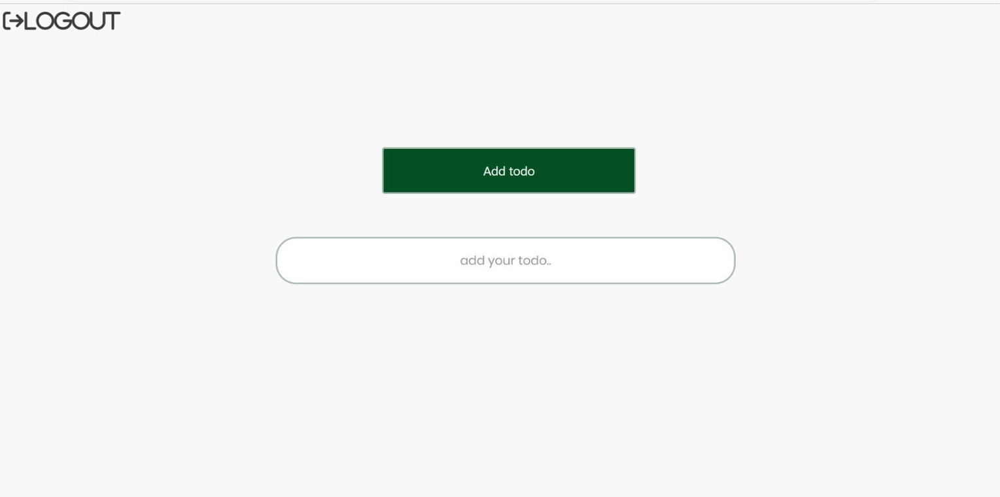

<h5 align='center' style="font-size:3rem"><b>Full Fledge Application</b></h5>

   

    <h2>LogIn</h2>
    </img>
     
       
    <h2>SignUp</h2>
    </img>
       
    <h2>Main</h2>
    </img>

    

<h1 align='center'><b>Abilities</b></h1>

<ul>
<li> Able To Run Server</li>
<li> Able To Login and Signup and even log-out</li>
<li> Able To add,edit a task and remove it</li>
<li> Able To making tasks checked</li>
</ul>

    
<h1 align='center'><b>Language and technologies used in This Project</h1>
</img>
</img>
</img>
</img>
</img>
</img>
</img>
</img>
</img>

  

<h1 align='center'><b>Requirements</b></h1>

Download and install ``NodeJS`` from official website <a href="https://nodejs.org/">nodeJS.org</a>

 

Download and install ``MongoDB`` from official website <a href="https://www.mongodb.com/try/download/community">mongoDB.com</a>

## Demo

<h1 align='center'><b>How To Run</b></h1>

At first you have to clone the project and open it in ``IDE``

 

Open IDE's terminal and then write  ``~ cd server`` and enter

 

After that write ``~ npm i`` and enter

 

type ``~ npm start`` and then enter

 

Now open another terminal and write ``~ cd client``

 

And then write ``~ npm i`` and ``~ npm start``

